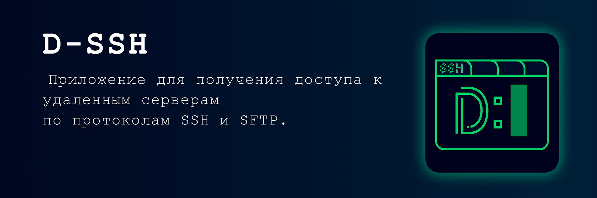
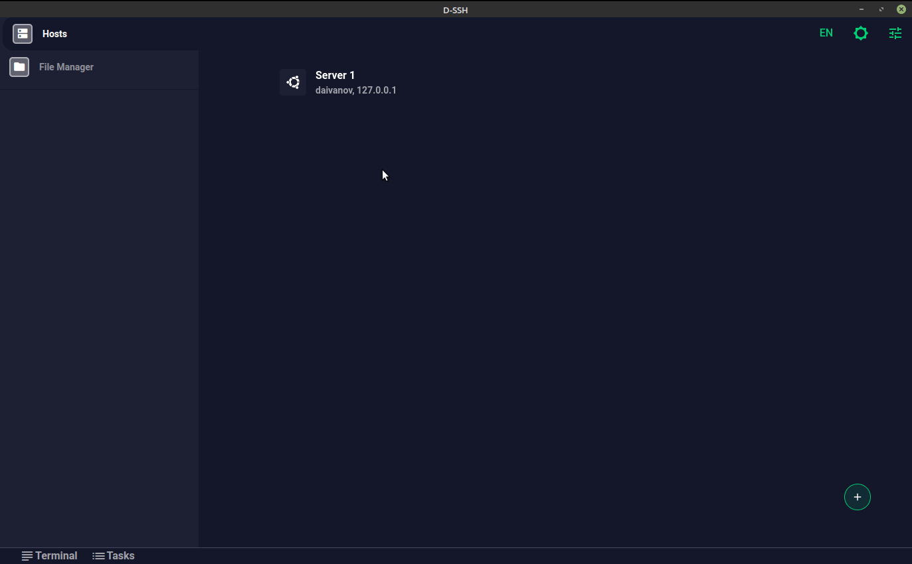
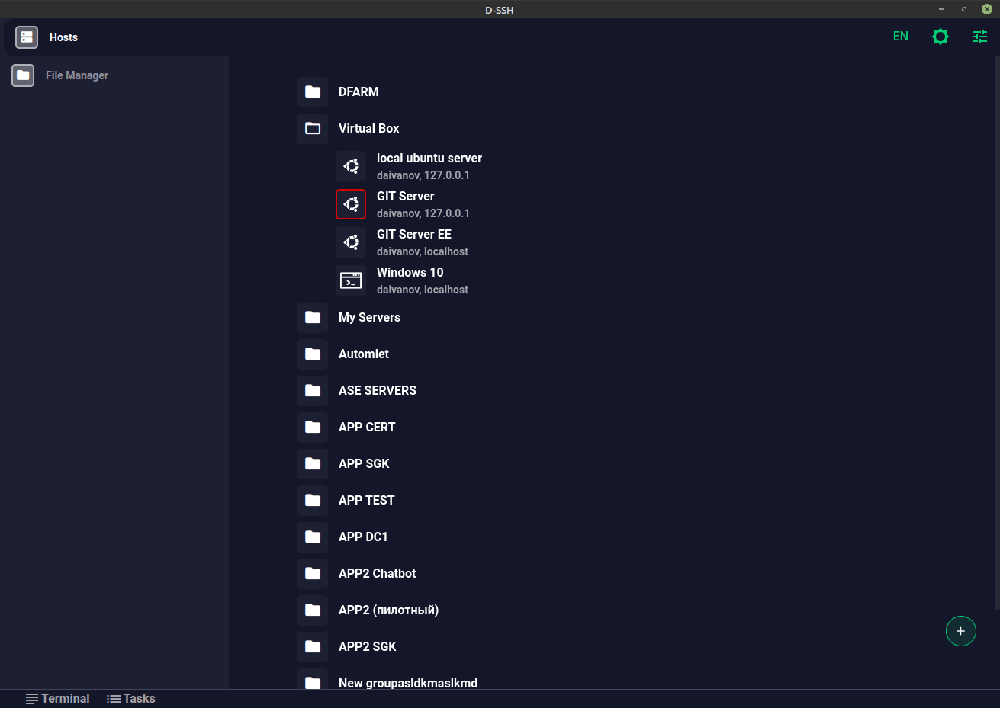
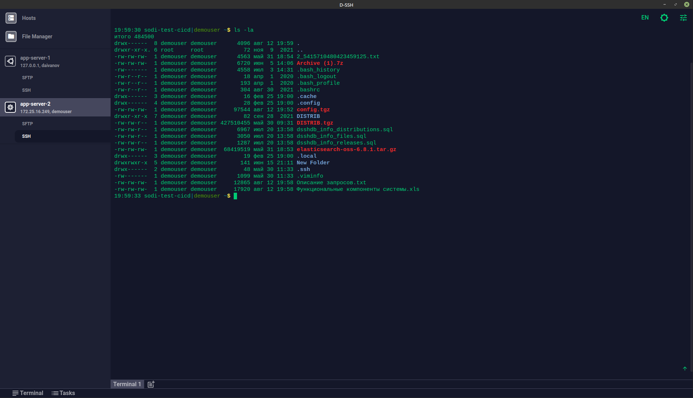
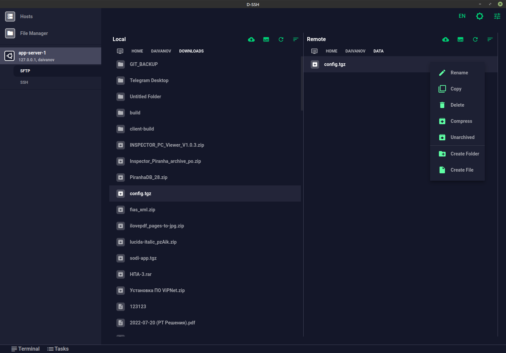
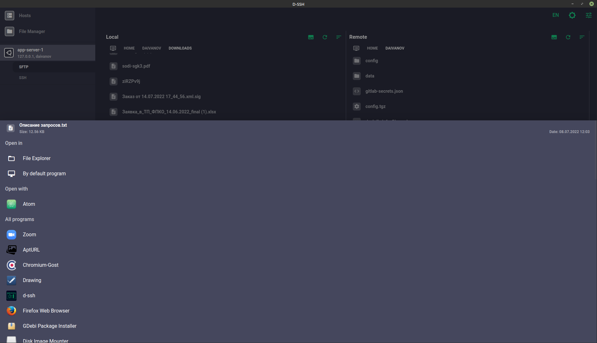

# D-SSH

**D-SSH** - приложение для работы с удаленными компьютерами по протоколам SSH и SFTP. Оно также позволяет хранить готовые конфигурации подключений в удобном для пользователя виде. Для ускорения работы с удаленными файлами в приложении реализован ряд функций: архивирование и разархивирование архивов, открытие файлов для редактирования без скачивания, удаление файлов и др. Также для большего удобства реализованы локальный терминал и локальный файловый менеджер.

  
    

# Документация и установка

### Для обновления приложения воспользуйтесь страницей FAQ [обновление приложения](https://d-ssh.ru/#/faq/code/update-app).

Для скачивания и установки последней версии приложения посетите сайт [d-ssh.ru](https://d-ssh.ru/#/download). Вы также можете скачать более старые версии на этой [странице](https://d-ssh.ru/#/download-other).

Если у Вас возникли вопросы по работе с приложением обратитесь к разделу [FAQ](https://d-ssh.ru/#/faq) на сайте приложения. При возникновении вопросов, не раскрытых на странице FAQ, Вы можете задать вопрос на странице [issue](https://github.com/dlabs71/d-ssh/issues) с пометкой (Label) _вопрос_.

Если Вы найдете какую-либо ошибку, пожалуйста, откройте вопрос на странице [github issue](https://github.com/dlabs71/d-ssh/issues) с пометкой (Label) _ошибка (bug)_.

## Поддерживаемые ОС:

* Windows 7 и выше
* Linux (Debian, RedHat). Ubuntu 18 и выше, Fedora 28 и выше
* Mac OSX 10.12+ (с процессором архитектуры x86 или M1)

# Screenshots

### Страница сохраненных подключений

### Страница SSH подключения

### Страница SFTP подключения

### Открытие удаленного файла

